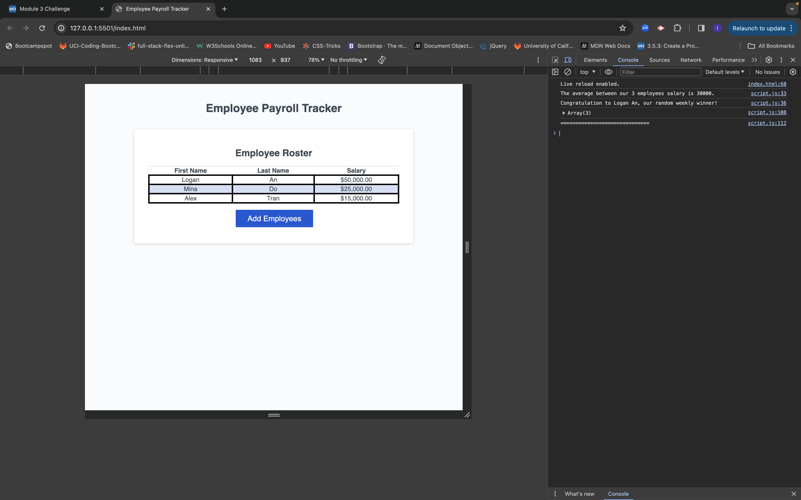

# <Employee Payroll>

## Description

As a payroll manager, I want a payroll tracker of all the emplyees so I can keep track of their payroll data and properly budget for the company.

## Installation

N/A

## Usage

Given an employee payroll tracker
when I click the "Add employee" button
I am presented with a series of prompts asking for first name, last name, and salary.
When I finish adding an employee
I am prompted to continue or cancel.
When I choose to continue
I am prompted to add a new employee.
When I choose to cancel
my employee data is displayed on the page sorted alphabetically by last name, and the console shows computed and aggregated data.

## Link

[Link text](https://website-name.com)https://alextran1985.github.io/Employee-Payroll/

## Screenshot

## Credits

N/A

## License

Please refer to the repository for license information.

